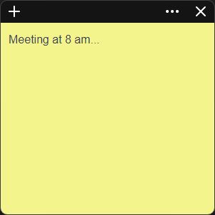

# 📝 Notifica Task

**Notifica Task** is a lightweight desktop app that combines the power of quick note-taking with time awareness and task scheduling. Inspired by Windows Sticky Notes, each note opens in its own independent window — with persistent positioning, resizing, and state.

## 🚀 Features

- 🗒️ Create, edit, and delete sticky notes
- 🕒 Each note remembers its window size and position
- 🧠 Persistent state: reopen and pick up where you left off
- 🪟 Multi-window: each note is a separate floating window
- 🔁 Real-time updates between open windows
- 🔔 Designed for notifications and task reminders _(future feature)_

## 🧩 Tech Stack

- **Electron** — multi-window desktop architecture
- **React + Vite** — fast, modern UI development
- **TypeScript** — type-safe codebase
- **electron-store** — local storage for note state

## 🖼 App Preview



## 📦 Installation

```bash
# Clone the repo
git clone https://github.com/your-username/notifica-task.git
cd notifica-task

# Install dependencies
npm install

# Start in development
npm run dev

```

## 📦 Download

You can download the latest version of Notifica Task for your platform:
| Platform | Installer |
| ---------- | ---------------------------------------------------------------------------------- |
| 🪟 Windows | [Download `.exe`](/download/notifica-task-windows-0.1.0-setup.exe) |
